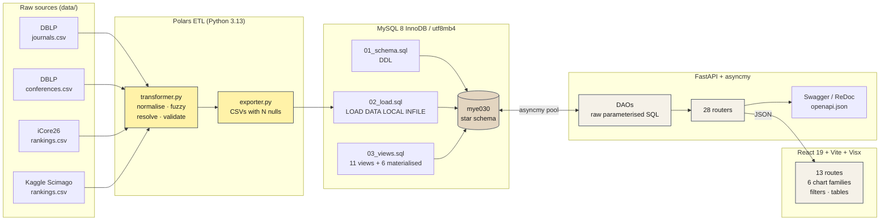
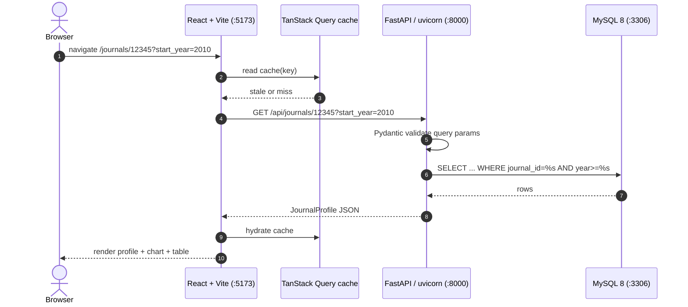
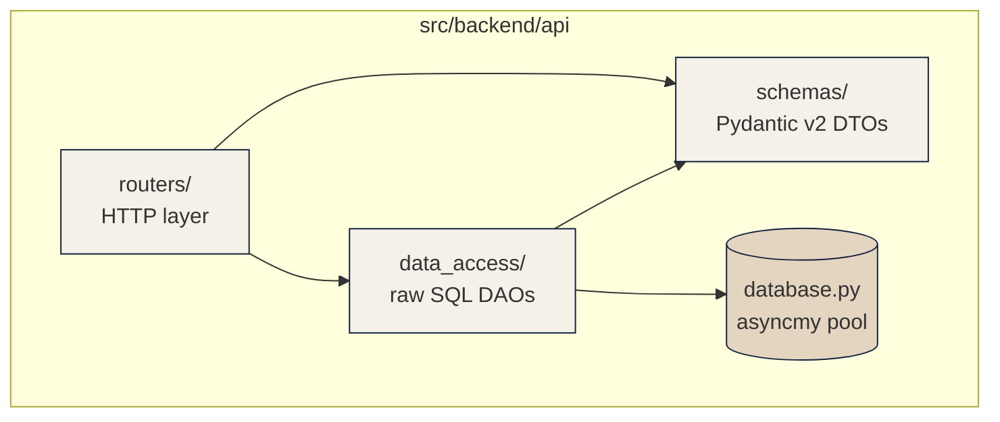

# MYE030 — Data Integration & Visualization Platform

> A relational analytics platform that ingests bibliographic data
> from **DBLP**, **Kaggle Scimago** and **iCore26** into a MySQL star
> schema and serves it through an async FastAPI back-end and a
> React / Visx front-end. University of Ioannina, Department of
> Computer Science & Engineering. Coursework MYE030 / ΠΛΕ045,
> Spring 2026.




---

> **First-time pull?** Read [`docs/ONBOARDING.md`](docs/ONBOARDING.md)
> first — it is the 20-minute walkthrough from `git clone` to a
> working app, including where to find the database backup and
> what to do when ports clash. The rest of this README is the
> long-form reference.

---

## Table of contents

1. [Overview](#overview)
2. [Prerequisites](#prerequisites)
3. [Clone and configure](#clone-and-configure)
4. [Run the platform](#run-the-platform--three-paths)
   - [Path 0 — full Docker stack (recommended)](#path-0--full-docker-stack-recommended)
   - [Paths A / B / C — host runtime](#paths-a--b--c--host-installed-runtime-advanced)
5. [What you can observe](#what-you-can-observe)
6. [Feature matrix](#feature-matrix)
7. [Smoke test (verify it works)](#smoke-test-verify-it-works)
8. [Running the tests](#running-the-tests)
9. [Database backup and restore](#database-backup-and-restore)
10. [Architecture in depth](#architecture-in-depth)
11. [Trade-offs at a glance](#trade-offs-at-a-glance)
12. [Project structure](#project-structure)
13. [Troubleshooting](#troubleshooting)
14. [Further reading](#further-reading)

---

## Overview

| Aspect | Number / Choice |
|---|---|
| Pipeline stages | 4 (Extract → Transform → Load → Materialise) |
| Source datasets | 3 (DBLP, Kaggle Scimago, iCore26) |
| Schema tables | 9 (4 lookups + 2 facts + 2 bridges + 1 rejection log) |
| Analytical views | 11 |
| Materialised aggregates | 6 InnoDB tables |
| HTTP endpoints | 28 business + `/health` + `/docs` + `/redoc` + `/openapi.json` |
| Frontend routes | 13 file-based routes |
| Chart families | 6 (Line, Bar, Scatter, Heatmap, StackedArea, HorizontalBarChart) |
| Backend tests | ~200 pytest tests, 95 % line coverage |
| Frontend tests | ~160 Vitest + ~50 Playwright E2E |
| Hard rules respected | No ORM, no SQL builders, no string-interpolated SQL, no in-Python aggregation |

---

## Prerequisites

Required for every run path:

| Tool | Minimum version | Why |
|---|---|---|
| Git | 2.30+ | Clone the repository |
| Docker Desktop / Docker Engine | 24.x+ | Runs the MySQL 8 container |
| Python | 3.13.x (NOT 3.14) | ETL pipeline + FastAPI server |
| uv | 0.4.x+ | Python package manager (replaces `pip` + `venv`) |
| Node.js | 20 LTS or 22 LTS | Required by `pnpm` to build the frontend |
| pnpm | 9.x+ | Frontend package manager |

Recommended (optional):

| Tool | Purpose |
|---|---|
| MiKTeX / TeX Live (`xelatex`) | Rebuild the LaTeX report from `deliverables/report/` |
| DataGrip / MySQL Workbench / `mysql` CLI | Browse the database, draw ER diagrams |
| VS Code / PyCharm / WebStorm | Edit code with full IntelliSense |
| Playwright | Run the end-to-end suite (`pnpm exec playwright install chromium`) |

> **Bare-minimum install:** Docker Desktop, Python 3.13 with `uv`,
> Node 22 LTS with `pnpm`. The per-OS subsections below show the
> exact commands. The "Recommended" tools above are only needed for
> deeper inspection.

### Install on Windows

Open **PowerShell** (not PowerShell ISE). Most installers below want
**Run as Administrator** the first time.

```powershell
# Git — https://git-scm.com/download/win (accept defaults)
git --version

# Docker Desktop — https://docker.com/products/docker-desktop/
# Tick "Use WSL 2 instead of Hyper-V" during install, reboot, launch Docker
docker --version
docker compose version

# Python 3.13
winget install --id Python.Python.3.13 --source winget
python --version            # expect Python 3.13.x

# uv (Astral)
powershell -ExecutionPolicy ByPass -c "irm https://astral.sh/uv/install.ps1 | iex"
# Close + reopen the terminal so PATH refreshes
uv --version

# Node 22 LTS + pnpm via Corepack
winget install --id OpenJS.NodeJS.LTS --source winget
corepack enable
corepack prepare pnpm@latest --activate
node --version              # expect v22.x
pnpm --version              # expect 9.x or 10.x
```

### Install on Debian / Ubuntu

```bash
sudo apt update
sudo apt install -y git ca-certificates curl
curl -fsSL https://get.docker.com | sh
sudo usermod -aG docker $USER          # log out / in after this
sudo add-apt-repository -y ppa:deadsnakes/ppa
sudo apt install -y python3.13 python3.13-venv
curl -LsSf https://astral.sh/uv/install.sh | sh
curl -fsSL https://deb.nodesource.com/setup_22.x | sudo -E bash -
sudo apt install -y nodejs
sudo corepack enable && corepack prepare pnpm@latest --activate
```

> **Other systems (macOS, Arch, Fedora …):** the tools below all have
> official binaries / Homebrew packages. Install Docker Desktop,
> Python 3.13, `uv`, Node 22 and `pnpm`; commands above are
> straightforward to translate.

---

## Clone and configure

```powershell
# Pick any folder. The path may contain spaces but not " or '.
git clone https://github.com/JohnAng/data-integration-viz-platform.git
cd data-integration-viz-platform
```

Copy `.env.example` to `.env`:

```powershell
# Windows
Copy-Item .env.example .env
# macOS / Linux
cp .env.example .env
```

The default values:

```
MYSQL_ROOT_PASSWORD=root
MYSQL_DATABASE=mye030
MYSQL_USER=Angelakos
MYSQL_PASSWORD=2403
MYSQL_CONTAINER_NAME=mye030_mysql
```

You can change them freely **before** the first `docker compose up`.
After the volume is initialised the credentials are baked in — to
change them you must drop the volume with `docker compose down -v`
(this destroys all data).

Both **Docker Compose** and **pydantic-settings** read `.env`
automatically.

---

## Run the platform — three paths

### Before you start — get the data

The repository on GitHub ships with **empty data folders** because the
raw CSVs (~722 MiB) and the MySQL backup (~172 MiB) exceed GitHub's
100 MiB per-file limit. The orchestrator (`python run.py`) auto-detects
what is on disk and chooses the fastest path, but you need to place at
least one of the two archives first.

| What you need | Where to put it | Result |
|---|---|---|
| `deliverables/db_backup.sql.gz` (~172 MiB) | `deliverables/` directly | Auto-restore on first boot (~3 min) |
| `data/dblp_dataset/*.csv` + `data/icore26_data/*.csv` + `data/journal_ranking_data_raw/*.csv` | matching subfolders of `data/` | Full ETL pipeline runs (~5 min) |
| Neither | — | `python run.py` exits with a banner listing the download sources |

**Where to get them:**

- **For evaluators**: links to both archives are in `AM2403_prj.txt`
  (submitted via `turnin`). The txt file lists Proton Drive URLs that
  open without a Proton account, plus the exact placement instructions
  reproduced above.
- **For the public**: the raw CSVs come from the original sources
  (one-time download, no auth required):
  - DBLP dump (article + inproceedings CSVs): <https://dblp.org/xml/release/>
  - iCore26 conference rankings: <http://portal.core.edu.au/conf-ranks/>
  - Kaggle Scimago journal ranking: search for *"Scimago Journal Ranking"* on Kaggle.

If you place **both** the backup and the raw CSVs, `python run.py`
prefers the backup (Path A). Use `python run.py --etl` to override and
force the ETL path.

### Path 0 — full Docker stack (recommended)

> **One command, no host-side Python / Node / uv / pnpm required.**
> Just Docker Desktop. ~3 min on first run (image builds + auto-restore).

#### Build mode

The Docker stack ships the frontend as a **production build**: Vite
compiles, tree-shakes and minifies the React source into
`/usr/share/nginx/html` inside the `mye030_frontend` image. Nginx
serves the pre-built bundle, no hot-reload, no source maps.

| Surface | What the user gets in Path 0 | What the user gets in Paths A/B/C |
|---|---|---|
| Build mode | Production (`vite build`, minified, content-hashed) | Development (`vite dev`, HMR, source maps) |
| Frontend server | nginx 1.27 alpine | Vite dev server |
| Edit & reload | Rebuild image | Hot module replacement |
| First request latency | <50 ms (static files) | ~300 ms (on-demand transpile) |
| Bundle size | ~600 KB gzipped | unminified, ~6 MB |
| Backend reload on save | No (immutable image) | Yes (`uvicorn --reload`) |

Use Path 0 for one-shot deployment and demos. Use Paths A/B/C while
actively editing code.

```powershell
python run.py
```

That single command does everything:

1. checks that Docker is running;
2. copies `.env.example` to `.env` on first run;
3. auto-detects whether the gzipped backup is present, the raw CSVs
   are present, or neither, and prints a clear hint in the third case;
4. builds the images on first run;
5. brings up MySQL, restores the backup (or runs the ETL), and waits
   until all three containers report healthy;
6. prints the final URLs.

Typical first-run walltime: **~2.5 minutes** with the backup present,
**~5 minutes** if the ETL has to run.

Other entry points:

| Command | What it does |
|---|---|
| `python run.py --status` | List container health + `/health` + `/api/meta/totals` |
| `python run.py --verify` | Run the data-quality SQL report |
| `python run.py --etl` | Force the ETL path even if the backup file is on disk |
| `python run.py --down` | Stop the stack (volume kept) |
| `python run.py --reset` | Stop the stack and wipe the data volume |
| `python run.py --help` | Print the full usage |

If you would rather avoid the wrapper, the underlying Docker
commands also work standalone:

```powershell
Copy-Item .env.example .env       # first time only
docker compose up -d --wait       # blocks until all 3 healthy
```

`docker compose up -d` alone returns as soon as containers are
*started*; on first boot the backup restore still has ~2 minutes
to go. `--wait` blocks the command until every healthcheck passes.

Three containers are built and started:

| Container | Image | Port | Healthcheck | Notes |
|---|---|---|---|---|
| `mye030_mysql` | `mysql:8.0` | `3306` | `mysqladmin ping` | Auto-restores `deliverables/db_backup.sql.gz` on first boot |
| `mye030_backend` | Built from `src/backend/Dockerfile` | `8000` | `GET /health` | uvicorn + asyncmy, waits for MySQL healthy |
| `mye030_frontend` | Built from `src/frontend/Dockerfile` (multi-stage Vite + nginx) | `5173` | `GET /` | nginx proxies `/api/*`, `/docs`, `/redoc`, `/openapi.json`, `/health` to backend |

Open <http://localhost:5173> — the entire app runs through nginx, no
CORS dances. The backend Swagger UI is at <http://localhost:5173/docs>
(proxied) or <http://localhost:8000/docs> (direct).

> **First boot auto-restore:** `deliverables/db_backup.sql.gz` is
> mounted read-only into the MySQL init folder. The tiny init script
> at `scripts/mysql-init.sh` `gunzip`-streams it into `MYSQL_DATABASE`
> the first time the volume is empty. If the backup file is missing,
> the init script logs a warning and leaves an empty schema — you
> would then need Path B.

#### Useful Docker Compose commands

```powershell
docker compose up               # foreground (Ctrl+C to stop)
docker compose up -d            # detached
docker compose logs -f          # tail every service
docker compose logs backend     # tail one service
docker compose ps               # status
docker compose restart backend  # restart one
docker compose down             # stop (volume persists)
docker compose down -v          # stop + drop the MySQL volume (wipes data)
```

### Paths A / B / C — host-installed runtime (advanced)

The host-installed paths exist for hot-reload development and for
running the ETL pipeline on raw CSVs. **Reviewers should prefer
Path 0 above.**

#### Shortcut — single-command bootstrap

```powershell
# Windows
.\scripts\setup.ps1
# Debian / Ubuntu
./scripts/setup.sh
```

The script does Path A end-to-end on the host (prereq check + `.env` +
MySQL container only + backend deps + restore + frontend deps).
Idempotent — safe to re-run. If `deliverables/db_backup.sql.gz` is
missing it prints the Path B commands instead.

### Path A — restore from backup (fastest, ~3 min)

The backup `deliverables/db_backup.sql.gz` (≈ 172 MiB compressed) is a
full `mysqldump` of the live database — schema + ~2.5M article rows +
~1.4M author rows + views + materialised tables.

> GitHub blocks files > 100 MiB. See the [Before you start — get the
> data](#before-you-start--get-the-data) section above for where to
> download `db_backup.sql.gz`; place it at
> `deliverables/db_backup.sql.gz` before running any of the commands
> below.

```powershell
docker compose up -d
cd src\backend ; uv sync ; cd ..\..
cd src\backend ; uv run python -m database.db_restore ; cd ..\..

# Quick sanity check
docker exec mye030_mysql mysql -uroot -proot mye030 -e "SELECT * FROM view_corpus_totals;"
```

Then [run the API](#running-the-http-api) and [the frontend](#running-the-frontend).

### Path B — full ETL from raw CSVs (~5 min)

Use if you placed the source CSVs in `data/` (see the [Before you
start — get the data](#before-you-start--get-the-data) section for
download URLs and the expected subfolder layout).

```powershell
docker compose up -d
cd src\backend
uv sync
uv run python etl/exporter.py                # → 9 CSVs in exports/
cd ..\..

docker exec -i mye030_mysql mysql --local-infile=1 -uroot -proot < sql_scripts/01_schema.sql
docker exec mye030_mysql mysql -uroot -proot -e "GRANT ALL PRIVILEGES ON mye030.* TO 'Angelakos'@'%'; FLUSH PRIVILEGES;"
docker exec -i mye030_mysql mysql --local-infile=1 -uroot -proot mye030 < sql_scripts/02_load.sql
docker exec -i mye030_mysql mysql -uroot -proot mye030 < sql_scripts/03_views.sql
```

> **PowerShell quirk:** if `<` does not pipe, replace each line with
> `Get-Content sql_scripts/01_schema.sql -Raw | docker exec -i mye030_mysql mysql ...`.

### Path C — clean rebuild

Wipe the volume and start over:

```powershell
docker compose down -v
docker compose up -d
# ...then Path A or Path B from step 3
```

### Running the HTTP API

```powershell
cd src\backend
uv run uvicorn api.main:application --reload --port 8000
```

The server listens on <http://127.0.0.1:8000>. Open <http://localhost:8000/docs>
for Swagger and <http://localhost:8000/redoc> for ReDoc.

### Running the frontend

```powershell
cd src\frontend
pnpm install                                    # once per environment
pnpm dev                                        # Vite dev server on :5173
```

The dev server proxies `/api/*` to `http://localhost:8000`. Override the
target with the `VITE_BACKEND_URL` environment variable.

---

## What you can observe

Every claim in this README is verifiable through one of the URLs or
commands below. No part of the system is black-box.

| Surface | URL / command | What it proves |
|---|---|---|
| **Live app** | <http://localhost:5173> | Landing → dashboard → profiles → charts |
| **Swagger UI** | <http://localhost:8000/docs> | Interactive call of every endpoint |
| **ReDoc** | <http://localhost:8000/redoc> | Static, narrative-style API reference |
| **OpenAPI JSON (live)** | <http://localhost:8000/openapi.json> | Machine-readable contract |
| **OpenAPI JSON (offline)** | [`docs/openapi.json`](docs/openapi.json) | Same contract, checked in; no server required |
| **Health probe** | <http://localhost:8000/health> | Liveness, returns `{"status":"ok"}` |
| **HTTP playbook** | `src/backend/api.http` | Click-to-run requests in PyCharm / VS Code REST Client |
| **DB CLI** | `docker exec -it mye030_mysql mysql -uroot -proot mye030` | Run any SQL directly |
| **Data quality report** | `docker exec -i mye030_mysql mysql -uroot -proot mye030 < scripts/data_quality_report.sql` | Row counts per table, entity-resolution match rates (journals 80.2 %, conferences 19.0 %), rejection-log breakdown, orphan / integrity checks (all 0 after a clean load). This script is the canonical source for every cleaning percentage quoted in the report. |
| **DB browser** | DataGrip / Workbench at `localhost:3306` | Visualise the schema + ER diagram |
| **Backend tests** | `cd src/backend && uv run pytest tests/ -q` | ~200 tests, green |
| **Coverage HTML** | `uv run pytest --cov --cov-report=html` then open `htmlcov/index.html` | Per-line coverage map |
| **Frontend tests** | `cd src/frontend && pnpm test` | ~160 Vitest tests, green |
| **E2E suite** | `pnpm exec playwright test` (both servers up) | ~50 specs |
| **E2E HTML report** | `pnpm exec playwright show-report` after a run | Per-test traces + screenshots |
| **Lint + types** | `uv run ruff check . && uv run pyright` | Zero errors |
| **PDF report** | [`deliverables/AM2403_projectReport.pdf`](deliverables/AM2403_projectReport.pdf) | 29 pages, full deliverable |
| **Video script** | [`deliverables/VIDEO_SCRIPT.md`](deliverables/VIDEO_SCRIPT.md) | Shot-by-shot |
| **UML diagrams** | [`diagrams/`](diagrams/) | ETL flow, packages, deployment as PlantUML + PNG |
| **Architecture & decisions** | [`docs/ARCHITECTURE.md`](docs/ARCHITECTURE.md) | One decision per section with alternatives + trade-offs |
| **Design system** | [`docs/design.md`](docs/design.md) | Quiet-luxury design tokens |
| **Glossary** | [`docs/GLOSSARY.md`](docs/GLOSSARY.md) | DBLP / SJR / iCore / FoR / quartile definitions |

---

## Feature matrix

Maps the brief's requirements onto the implementation.

### ETL (data integration)

| Requirement | Implementation | File | How to verify |
|---|---|---|---|
| Read 3 heterogeneous sources | Polars LazyFrames over CSV | `src/backend/etl/transformer.py` | `uv run python etl/transformer.py` prints row counts |
| Normalise / canonicalise titles | `expand_abbreviations` + lowercase + strip | same | inline unit tests in `tests/unit/` |
| Acronym resolution (DBLP ↔ iCore) | case-insensitive exact join on acronym | same | rejection log entries |
| Fuzzy resolution (DBLP ↔ Kaggle) | `rapidfuzz.token_set_ratio ≥ 85` | same | match-rate logs printed at end of ETL |
| Validation | NULL titles, year ∉ [1900, 2030], empty authors → rejected | same | inspect `rejection_logs` table after load |
| Quarantine, no silent loss | rejection log table populated by `02_load.sql` | `sql_scripts/02_load.sql` | `SELECT COUNT(*), reason FROM rejection_logs GROUP BY reason;` |
| Export with `\N` nulls for `LOAD DATA INFILE` | `polars.write_csv(null_value="\\N")` | `src/backend/etl/exporter.py` | inspect any file in `exports/` |
| Bulk load via raw SQL | `LOAD DATA LOCAL INFILE` | `sql_scripts/02_load.sql` | run script, watch row counts |

### Database (relational warehouse)

| Requirement | Implementation | File | How to verify |
|---|---|---|---|
| Integer PKs (no string PKs) | `INT UNSIGNED AUTO_INCREMENT` on every lookup PK | `sql_scripts/01_schema.sql` | `DESCRIBE lookup_journals;` |
| FK integrity | Bridges + facts FK to lookups; `ON UPDATE CASCADE` | same | `SHOW CREATE TABLE bridge_journal_article_authors;` |
| Wide journal dimension | every Kaggle metric column inside `lookup_journals` | same | `DESCRIBE lookup_journals;` shows 16 ranking columns |
| Aggregations inside DBMS (no in-Python) | every aggregate is a SQL view or CTE | `sql_scripts/03_views.sql` | `SHOW FULL TABLES IN mye030 WHERE Table_type='VIEW';` |
| Heavy aggregates as materialised tables | 6 InnoDB tables created with `CREATE TABLE … AS SELECT …` | same | `SHOW TABLES LIKE 'materialized_%';` |
| Parameterised queries only | every DAO uses `%s` placeholders | `src/backend/api/data_access/*.py` | `grep -r "f'.*SELECT" src/backend/api` → empty |
| Backup that recreates DB automatically | gzipped `mysqldump` + restore helper | `src/backend/database/db_backup.py` & `db_restore.py` | `uv run python -m database.db_restore` |

### HTTP API

| Requirement | Implementation | File | How to verify |
|---|---|---|---|
| 28 endpoints | 6 routers under `api/routers/` | listed in `docs/API_REFERENCE.md` | <http://localhost:8000/docs> |
| Async all the way down | every handler `async def`, asyncmy pool | `src/backend/api/database.py` | grep — no sync DB calls |
| Auto OpenAPI generation | FastAPI + Pydantic | `src/backend/api/main.py` | <http://localhost:8000/openapi.json> |
| RFC 7807 problem-details on errors | custom exception handler | `src/backend/api/errors.py` | hit `/api/journals/99999999` |
| Server-side pagination | uniform `PaginatedResponse[T]` envelope | `src/backend/api/schemas/common.py` | inspect any list response |
| Year-range filter recomputes aggregates | `start_year` / `end_year` on every profile + chart endpoint | `data_access/*` | call same endpoint with and without range |
| Substring filters with prepopulated dropdowns | `/api/meta/options` feeds every dropdown | `src/backend/api/data_access/meta.py` | <http://localhost:8000/api/meta/options> |

### Frontend

| Requirement | Implementation | File | How to verify |
|---|---|---|---|
| List + profile pages per entity | 13 file-based routes | `src/frontend/src/routes/` | navigate the app |
| Year-range filter recomputes stats | `YearRangeFilter` writes search params; queries recompose | `src/frontend/src/components/filters/YearRangeFilter.tsx` | watch the line chart change on Apply |
| LineCharts, BarCharts, ScatterPlots | three Visx chart components | `src/frontend/src/components/charts/` | /charts page |
| Multi-series filtering & legends | `InteractiveLegend` toggles series | `src/frontend/src/components/charts/InteractiveLegend.tsx` | click a legend chip |
| Server-side sort + sticky header | `PaginatedTable` writes `sort_by` + `sort_order` | `src/frontend/src/components/tables/PaginatedTable.tsx` | click a column header |
| Heatmap + StackedArea + Cumulative growth | extra chart families | `src/frontend/src/components/charts/Heatmap.tsx` + `StackedArea.tsx` + `HorizontalBarChart.tsx` | /charts switcher |
| Drag-to-zoom on every line chart | brush implementation in `LineChart.tsx` | same | drag across the X axis |
| Voronoi nearest-x hover | hover overlay in `LineChart.tsx` | same | hover anywhere over the line chart |
| Debounced text search inputs | `useDebounce` hook | `src/frontend/src/hooks/useDebounce.ts` | type fast in any search input |
| URL-driven filters (shareable) | TanStack Router search params + Zod | every route file | copy URL, paste in new tab |

### Quality assurance

| Requirement | Implementation | File | How to verify |
|---|---|---|---|
| Unit tests | `tests/unit/` | `src/backend/tests/unit/` | `uv run pytest tests/unit -q` |
| Integration tests against real MySQL | `tests/integration/` with seed fixture | `src/backend/tests/integration/fixtures/seed.sql` | `uv run pytest tests/integration -q` |
| Frontend unit + route tests | Vitest + Testing Library + MSW | `src/frontend/src/**/*.test.tsx` | `pnpm test` |
| Frontend E2E | Playwright (chromium) | `src/frontend/e2e/*.spec.ts` | `pnpm exec playwright test` |
| Coverage reports | pytest-cov + Vitest v8 | `htmlcov/` and `coverage/` | `--cov-report=html` / `pnpm test:coverage` |
| Static analysis | ruff + pyright + eslint + tsc | configs in `pyproject.toml` + `eslint.config.*` | run any of the four |

### Deliverables

| Requirement | Implementation | File |
|---|---|---|
| PDF technical report | XeLaTeX, 29 pages, Greek | `deliverables/AM2403_projectReport.pdf` |
| `mysqldump` backup that can recreate DB automatically | gzipped + idempotent restore CLI | `deliverables/db_backup.sql.gz` |
| Demo video | 15-min walkthrough | `deliverables/AM2403_demo.mp4` (planned) |
| Turn-in file | UoI turnin payload | `deliverables/AM2403_prj.txt` |

---

## Smoke test (verify it works)

After **any** of the three paths above and both servers running:

```powershell
# Backend liveness
curl http://localhost:8000/health
# → {"status":"ok"}

# Real KPI tile data
curl http://localhost:8000/api/meta/totals
# → {"total_articles":...,"total_authors":...,...}

# Pagination envelope
curl "http://localhost:8000/api/journals?page_size=2"
# → {"items":[...],"page":1,"page_size":2,"total_items":...}

# RFC 7807 error path
curl http://localhost:8000/api/journals/99999999
# → {"type":"about:blank","title":"Not Found","status":404,...}
```

Open <http://localhost:5173> and verify:

- 3 KPI tiles on the landing page show real numbers (not `—`).
- `/dashboard` line chart has data.
- `/journals` paginates and filters.
- `/charts` switches between 6 chart families and accepts filters.

---

## Running the tests

```powershell
# Backend (needs MySQL container; creates mye030_test, loads seed.sql)
cd src\backend
uv run pytest tests/ -q
uv run pytest tests/ --cov --cov-report=html         # → htmlcov/index.html
uv run pytest tests/unit -q                          # no DB needed

# Frontend unit + integration (no DB, no backend; MSW mocks)
cd src\frontend
pnpm test
pnpm test:coverage                                   # → coverage/index.html
pnpm test:watch                                      # watch mode

# Frontend E2E (both servers live)
docker compose up -d
cd src\backend
uv run uvicorn api.main:application --port 8000 &
cd ..\frontend
pnpm dev &
pnpm exec playwright install chromium               # first time only
pnpm exec playwright test
pnpm exec playwright show-report                    # HTML report with traces
```

---

## Database backup and restore

```powershell
cd src\backend

# Produce deliverables\db_backup.sql.gz (full mysqldump, gzipped, ~160 MiB)
uv run python -m database.db_backup

# Re-import the dump into the (already existing) target database
uv run python -m database.db_restore
```

Both commands read `MYSQL_CONTAINER_NAME`, `MYSQL_DATABASE` and
`MYSQL_ROOT_PASSWORD` from `.env` via `pydantic-settings` and stream
through Python's `gzip` straight into / out of `docker exec mysqldump`
(or `mysql`). The raw uncompressed dump never has to land on disk.

Typical output sizes for the full dataset:

| Stage | Size | Notes |
|---|---|---|
| Raw `mysqldump` SQL | ~515 MiB | All tables, indexes, views |
| Compressed `.sql.gz` | ~160 MiB | `compresslevel=9` |

> The compressed backup exceeds GitHub's 100 MiB hard file-size limit.
> Ship it via a GitHub Release attachment, not the repo.

---

## Architecture in depth

The full ADR-style record is in [`docs/ARCHITECTURE.md`](docs/ARCHITECTURE.md).
Highlights:

### Request lifecycle



### Repository layers



ETL data-flow diagram (UML «activityETL» notation, UoI
*Blueprints4ETL* style) is in [`diagrams/etl-dataflow.png`](diagrams/etl-dataflow.png).

---

## Trade-offs at a glance

| Decision | Why | Cost accepted |
|---|---|---|
| Raw SQL via asyncmy, no ORM | Brief requirement + 4× throughput vs aiomysql | Every endpoint is a hand-written DAO method |
| Wide journal dimension | One-row reads, simple indexes | ~170 KB extra storage |
| Materialised aggregates | 11–46 s → < 0.3 s queries | Snapshots are read-only between `03_views.sql` runs |
| Hybrid entity resolution (exact + fuzzy) | Best of both worlds: 100 % precision on acronyms, recall on fuzzy titles | 81 % of DBLP conferences unranked (visible via `ranked_only` filter) |
| FastAPI + Pydantic v2 | Free OpenAPI, async, RFC 7807 errors | Two type systems (Pydantic + TS) kept in sync by hand |
| Visx over Recharts | Pixel-perfect charts with drag-to-zoom + Voronoi hover | More component code per chart |
| URL-driven filters (TanStack Router search params) | Every page state is shareable, browser back works | Filters must be schema-validated (Zod) |
| RFC 7807 problem-details everywhere | Single error envelope, machine-readable | Custom handlers in `api/errors.py` |
| Polars over pandas | ~10× faster, lower memory on this size | Less mature ecosystem |
| Static post-ETL warehouse pattern | Matches the brief's read-mostly workload | No live ingest; ETL is a re-run, not a tail |

Full reasoning, alternatives considered and consequences are in
[`docs/ARCHITECTURE.md`](docs/ARCHITECTURE.md).

---

## Project structure

```
.
├── README.md                       this file
├── docker-compose.yml              MySQL 8 service + volume mounts
├── .env                            credentials (git-ignored)
├── .env.example                    template
├── scripts/
│   ├── setup.ps1                   one-shot bootstrap (Windows)
│   └── setup.sh                    one-shot bootstrap (macOS / Linux)
├── data/                           raw input CSVs (git-ignored)
├── exports/                        ETL outputs (git-ignored)
├── sql_scripts/
│   ├── 01_schema.sql               DDL: tables, indexes, FKs
│   ├── 02_load.sql                 DML: LOAD DATA LOCAL INFILE per table
│   └── 03_views.sql                11 views + 6 materialised tables
├── diagrams/                       PlantUML sources + PNG exports
├── docs/
│   ├── API_REFERENCE.md            endpoint-by-endpoint reference
│   ├── ARCHITECTURE.md             ADR-style decisions and trade-offs
│   ├── GLOSSARY.md                 domain terms
│   ├── design.md                   visual design system
│   └── openapi.json                static OpenAPI 3.1 document
├── src/
│   ├── backend/                    Python 3.13 + FastAPI + asyncmy
│   └── frontend/                   React 19 + Vite + TanStack + Visx
└── deliverables/                   PDF report + video script + db_backup.sql.gz
```

---

## Troubleshooting

| Symptom | Likely cause | Fix |
|---|---|---|
| `docker: command not found` | Docker not installed or PATH missing | Re-install Docker Desktop, restart terminal |
| `Cannot connect to the Docker daemon` | Docker Desktop not running | Launch Docker Desktop, wait for the whale icon to stop animating |
| `Bind for 0.0.0.0:3306 failed: port is already allocated` | A local MySQL is using 3306 | Stop the local server, **or** set `MYSQL_PORT=3307` in `.env` and `docker compose up -d` again — see ["Port conflicts" below](#port-conflicts) |
| Frontend container shows nginx HTML but `/docs` returns `Not Found` and you see `/@vite/client` in the page source | A host-side `pnpm dev` is also listening on `5173`; the OS routes traffic to it instead of the docker nginx | Stop the host-side Vite (`Ctrl+C` in that terminal), **or** set `FRONTEND_PORT=5273` in `.env` and recreate the stack |
| `Access denied for user 'Angelakos'@'%'` | Volume initialised with different credentials | `docker compose down -v` then bring back up; or run the `GRANT` line shown in Path B |
| `LOAD DATA LOCAL INFILE … is disabled` | `local_infile` off | Already set in `docker-compose.yml`; ensure you did not edit the `command:` block |
| `pyright` / `ruff` reports type errors after `uv sync` | Stale `.venv` | `Remove-Item -Recurse -Force .venv` then `uv sync` again |
| `pnpm install` complains about peer deps | Old corepack pin | `corepack prepare pnpm@latest --activate` |
| `xelatex: command not found` | TeX distribution missing | Install MiKTeX (Windows) / MacTeX (macOS) / `texlive-xetex` (Linux). Only needed to rebuild the PDF |
| Frontend shows `—` for KPI tiles | Backend not reachable | Confirm uvicorn is up at `:8000`; check devtools network tab |
| `deliverables/db_backup.sql.gz` missing | Stripped because >100 MiB | Download from the GitHub Release; place under `deliverables/` |
| `Float too large for page` (LaTeX) | A figure grew | Reduce `width=` or add `height=0.78\textheight,keepaspectratio` |
| `MiKTeX: cannot retrieve attributes for ...\\X.exe` | MiKTeX iterates `PATH` and stumbles on a directory whose name ends in `.exe` | Temporarily remove the offending entry from `PATH` before running xelatex |

---

### Port conflicts

All three host-facing ports are **configurable through `.env`** so a
clash with something else on the host does not require editing
tracked files:

| Variable | Default | Container target |
|---|---|---|
| `FRONTEND_PORT` | `5173` | `mye030_frontend:80` (nginx) |
| `BACKEND_PORT` | `8000` | `mye030_backend:8000` (uvicorn) |
| `MYSQL_PORT` | `3306` | `mye030_mysql:3306` |

If a port is taken, set a free one in `.env` and bring the stack back
up:

```
# .env
FRONTEND_PORT=5273      # Vite default 5173 was busy
MYSQL_PORT=3307         # local MySQL service was on 3306
```

```powershell
docker compose down
docker compose up -d
```

The `scripts/setup.ps1` / `scripts/setup.sh` bootstrap script
performs a **pre-flight port check** and exits with a clear message
identifying the offending process before any container is started.
Common culprits:

- A stale `pnpm dev` on `5173` (kill the host-side Vite, **or** flip
  `FRONTEND_PORT`).
- A locally installed MySQL service on `3306` (Stop-Service MySQL on
  Windows, `sudo systemctl stop mysql` on Linux, **or** flip
  `MYSQL_PORT`).
- Another `uvicorn` on `8000`.

> **Why this matters:** when both a host-side `pnpm dev` and the
> docker `mye030_frontend` bind to `5173`, the OS routes external
> traffic to whichever bound first — usually `pnpm dev`. The
> visitor then sees the dev SPA at the URL instead of the proxied
> Swagger / ReDoc / `/openapi.json`. The pre-flight check in the
> setup script prevents that scenario; without the script, use
> `.env` to relocate the conflicting port.

---

## Further reading

| Document | When to read |
|---|---|
| [`docs/ONBOARDING.md`](docs/ONBOARDING.md) | First-time pull, want the shortest path to a running app |
| [`docs/ARCHITECTURE.md`](docs/ARCHITECTURE.md) | Want the *why* behind each design decision |
| [`docs/API_REFERENCE.md`](docs/API_REFERENCE.md) | Want every endpoint + every parameter + every DTO field |
| [`docs/openapi.json`](docs/openapi.json) | Want a machine-readable contract |
| [`docs/design.md`](docs/design.md) | Want to recreate the visual design |
| [`docs/GLOSSARY.md`](docs/GLOSSARY.md) | Encountered an unfamiliar term |
| [`src/backend/README.md`](src/backend/README.md) | Hacking on Python / FastAPI / SQL |
| [`src/backend/api.http`](src/backend/api.http) | Want to fire requests by hand |
| [`src/frontend/README.md`](src/frontend/README.md) | Hacking on React / Visx / Tailwind |
| [`deliverables/AM2403_projectReport.pdf`](deliverables/AM2403_projectReport.pdf) | Final 34-page writeup |
